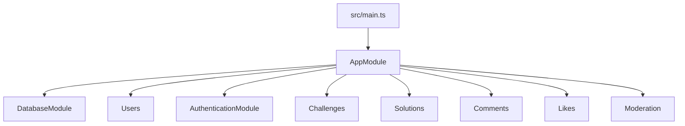

# AppModule

## Papel

Composition root sem regra de negócio. Importa todos os módulos ativos.

```mermaid
flowchart TD
    Main[src/main.ts] --> App[AppModule]
    App --> DB[DatabaseModule]
    App --> Users
    App --> Auth[AuthenticationModule]
    App --> Challenges
    App --> Solutions
    App --> Comments
    App --> Likes
    App --> Moderation
```

Não possui endpoints próprios. O Swagger é montado pelo bootstrap, não por controller.
